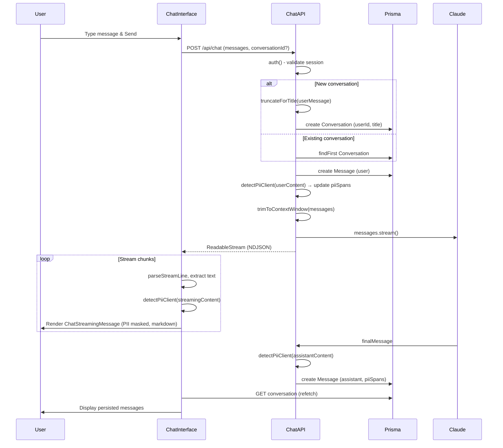
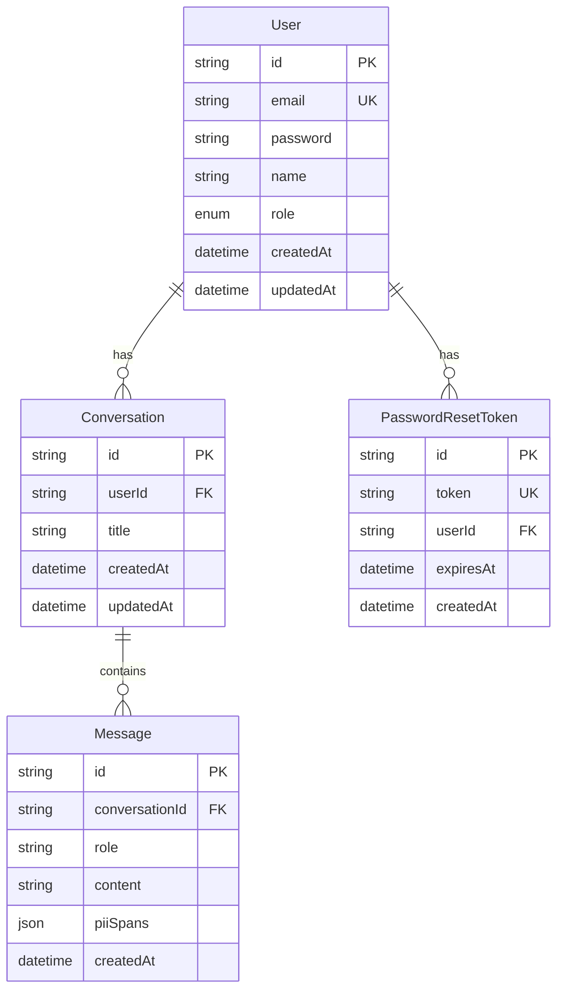

# Chat Application

A full-stack chat application built with Next.js 16, featuring AI-powered conversations via Anthropic Claude, PII detection/masking, markdown rendering, and authentication.

## Table of Contents

- [Chat Application](#chat-application)
  - [Table of Contents](#table-of-contents)
  - [Architecture Overview](#architecture-overview)
  - [System Architecture Diagram](#system-architecture-diagram)
  - [Chat Flow Diagram](#chat-flow-diagram)
  - [Features \& Implementation](#features--implementation)
    - [1. Authentication](#1-authentication)
    - [2. Chat with AI Streaming](#2-chat-with-ai-streaming)
    - [3. PII Detection \& Masking](#3-pii-detection--masking)
    - [4. Markdown Rendering](#4-markdown-rendering)
    - [5. Message Input](#5-message-input)
    - [6. Conversations \& Sidebar](#6-conversations--sidebar)
  - [Database Schema](#database-schema)
  - [Environment Variables](#environment-variables)
  - [Getting Started](#getting-started)
    - [Prerequisites](#prerequisites)
    - [Setup](#setup)
    - [Scripts](#scripts)

---

## Architecture Overview

The application follows a layered architecture:

- **Frontend**: Next.js App Router, React 19, TanStack Query, Tailwind CSS
- **Backend**: Next.js API Routes, Prisma ORM
- **AI**: Anthropic Claude (Sonnet for chat, Haiku for PII detection — currently disabled)
- **Auth**: NextAuth.js with credentials provider
- **Database**: PostgreSQL

---

## System Architecture Diagram

```mermaid
flowchart TB
    subgraph Client["Client (Browser)"]
        UI[Chat Interface]
        ChatInput[Chat Input]
        ChatMessage[Chat Message]
        PiiMasked[PiiMaskedText]
        Markdown[MarkdownRenderer]
        detectClient[detectPiiClient]
        
        UI --> ChatInput
        UI --> ChatMessage
        ChatMessage --> PiiMasked
        PiiMasked --> Markdown
        PiiMasked --> detectClient
    end

    subgraph API["Next.js API Routes"]
        ChatAPI["/api/chat"]
        ConvAPI["/api/chat/conversations"]
        AuthAPI["/api/auth/[...nextauth]"]
        PiiAPI["/api/pii/detect"]
    end

    subgraph Server["Server"]
        Auth[auth()]
        Prisma[(Prisma)]
        Anthropic[Anthropic Claude]
        detectClientSvr[detectPiiClient]
        
        ChatAPI --> Auth
        ChatAPI --> Prisma
        ChatAPI --> Anthropic
        ChatAPI --> detectClientSvr
        ConvAPI --> Auth
        ConvAPI --> Prisma
        AuthAPI --> Prisma
    end

    subgraph DB[(PostgreSQL)]
        User[(User)]
        Conv[(Conversation)]
        Msg[(Message)]
    end

    Prisma --> DB
    UI -->|POST /api/chat| ChatAPI
    UI -->|GET /api/chat/conversations| ConvAPI
```

---

## Chat Flow Diagram



---

## Features & Implementation

### 1. Authentication

- **NextAuth.js** with credentials provider (email + password)
- **Registration**: Server action with Zod validation, bcrypt password hashing (12 rounds)
- **Protected routes**: `(protected)` layout checks session; redirects to login if unauthenticated
- **Password reset**: Brevo email integration for reset links

**Key files**: `src/lib/auth.ts`, `src/actions/auth.ts`, `src/app/(auth)/*`

---

### 2. Chat with AI Streaming

- **Claude Sonnet 4.5** via Anthropic SDK
- **Streaming**: `anthropic.messages.stream()` → `toReadableStream()` returns NDJSON
- **Client parsing**: `parseStreamLine()` + `readStreamLines()` extract `delta.text` from each line
- **Context window**: `trimToContextWindow()` trims oldest messages if token count exceeds 180K
- **Conversation title**: First user message truncated to 50 chars (e.g. "Hello, can you help me with..." → "Hello, can you help me with...")

**Key files**: `src/app/api/chat/route.ts`, `src/lib/llm/client.ts`, `src/components/chat/utils.ts`

---

### 3. PII Detection & Masking

**Client-side regex** (currently active):

- **email**: `[a-zA-Z0-9._%+-]+@[a-zA-Z0-9.-]+\.[a-zA-Z]{2,}`
- **credit_card**: `(?:\d{4}[-.\s]?){3}\d{4}` or `\d{13,19}`
- **code**: Alphanumeric 6+ chars with at least one letter and one digit (e.g. `AV18HJDSAG`)

**LLM-based detection** (disabled, code commented):

- `detectPii()` in `src/lib/pii/detect.ts` uses Claude Haiku for broader PII types
- Previously overwrote regex spans in DB; currently disabled

**Display**:

- `PiiMaskedText` renders content with PII spans blurred; click to reveal/mask
- Spans stored in `Message.piiSpans` (JSON) and used on load; client regex used for streaming

**Key files**: `src/lib/pii/client-detect.ts`, `src/components/chat/pii-masked-text.tsx`

---

### 4. Markdown Rendering

- **react-markdown** + **remark-gfm** for GitHub Flavored Markdown
- **MarkdownRenderer**: Custom component with styled headings, lists, code blocks, tables, blockquotes, links
- **Integration**: `PiiMaskedText` uses `MarkdownRenderer` for text segments (with or without PII spans)
- **Modes**: `compact` for chat, `inline` for text between PII spans

**Key files**: `src/lib/markdown/markdown-renderer.tsx`, `src/components/chat/pii-masked-text.tsx`

---

### 5. Message Input

- **Max height**: 200px with `overflow-y-auto`
- **Character limit**: 4000 (configurable via `maxLength` prop)
- **Counter**: Displays `{length} / {maxLength}`
- **Enter to send**, Shift+Enter for newline

**Key file**: `src/components/chat/chat-input.tsx`

---

### 6. Conversations & Sidebar

- **List**: `GET /api/chat/conversations` returns user's conversations (title, message count, dates)
- **Sidebar**: `AppSidebar` shows "New chat" + conversation list with links to `/chat/[id]`
- **TanStack Query**: `useConversations()`, `useConversation(id)` for fetching and invalidation

**Key files**: `src/app/api/chat/conversations/route.ts`, `src/components/app-sidebar.tsx`, `src/hooks/use-conversations.ts`

---

## Database Schema



---

## Environment Variables

| Variable           | Required | Description                    |
| ------------------ | -------- | ------------------------------ |
| `DATABASE_URL`     | Yes      | PostgreSQL connection string   |
| `NEXTAUTH_SECRET`  | Yes      | NextAuth encryption secret     |
| `NEXTAUTH_URL`     | No       | App URL (default: localhost)   |
| `ANTHROPIC_API_KEY`| Yes      | Anthropic API key for Claude   |
| `BREVO_API_KEY`    | Yes      | Brevo (Sendinblue) for email   |
| `EMAIL_FROM_EMAIL` | Yes      | Sender email for Brevo         |
| `CONTACT_EMAIL`    | Yes      | Contact email for support      |
| `EMAIL_FROM_NAME`  | No       | Sender display name            |
| `NEXT_PUBLIC_LOG_LEVEL` | No  | Client log level (debug/info/warn/error/none) |

---

## Getting Started

### Prerequisites

- Node.js 18+
- PostgreSQL
- Anthropic API key
- Brevo account (for password reset emails)

### Setup

1. **Clone and install**

   ```bash
   npm install
   ```

2. **Environment**

   Create a `.env` file with the variables listed in [Environment Variables](#environment-variables).

3. **Database**

   ```bash
   npx prisma migrate dev
   ```

4. **Run**

   ```bash
   npm run dev
   ```

   Open [http://localhost:3000](http://localhost:3000).

### Scripts

| Command       | Description              |
| ------------- | ------------------------ |
| `npm run dev` | Start dev server         |
| `npm run build` | Prisma generate + build |
| `npm run start` | Start production server |
| `npm run typecheck` | TypeScript check      |
| `npm run lint` | ESLint                   |
